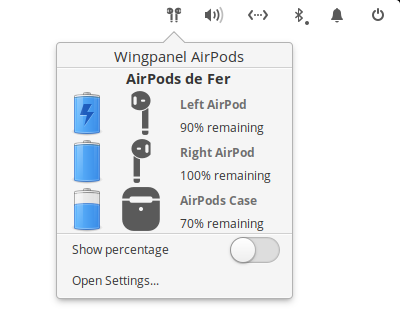

<p align="center">
  
</p>
<h1 align="center">Wingpanel AirPods</h1>

## About

Wingpanel AirPods is a status indicator that displays Apple's AirPods status information in elementary OS Wingpanel.

Being this one of my first Vala applications I'm sure that the code can be improved, so:

- If you find any problems while running the application please report it through an issue.
- Pull requests are welcome.
- Feedback and suggestions are always welcome as well.

### Features:

- Displays AirPods connection status
- Displays AirPods battery charge percentage in the indicator
- Displays battery charge status per AirPod and also for the charging case in the popover
- Notifys the user when the AirPods battery is running low

### Requirements

- elementary OS 5.1.7 Hera
- Bluetooth 4.0 controller with BLE support

## Screenshots

### Indicator


### Indicator (inc. battery charge percentage):

### Popover:



### Popover (inc. battery charge percentage):

### Settings:


## Building and installation from source

You'll need the following dependencies:

```
libglib2.0-dev
libgranite-dev
libgtk-3-dev
libwingpanel-2.0-dev
libnotify-dev
meson
valac
```

You can install them running:

```
sudo apt install libgranite-dev libgtk-3-dev libwingpanel-2.0-dev meson valac libnotify-dev
```

Run `meson` to configure the build environment and then `ninja` to build

```
meson build --prefix=/usr
cd build
ninja
```

To install, use `ninja install`

```
sudo ninja install
com.github.casasfernando.wingpanel-indicator-airpods
```

## Installation using the deb package

You can also find a deb package available with every release in the releases page.
To install it you just need to download it and run:

```
sudo dpkg -i wingpanel-indicator-airpods_<release>_amd64.deb
```

## Special thanks and credits

 - [Federico Dossena](https://github.com/adolfintel) for developing [OpenPods](https://github.com/adolfintel/OpenPods) and the beacon data decoding algorithm on which the beacon decoding code of this project is based on.
